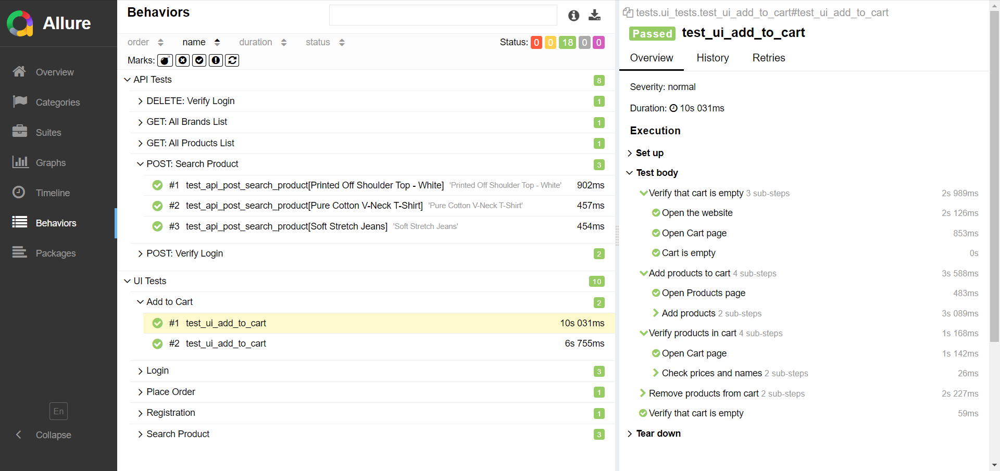

# INT-12 | QA

## 1. Установка
- Склонировать репозиторий
- Установить зависимости
```
pip3 install -r requirements.txt
```
- Для запуска браузера в headless режиме необходимо добавить `.env` файл в корень проекта:
    - `HEADLESS=True`
- Для просмотра отчетов allure необходимо установить `allure` по [инструкции](https://allurereport.org/docs/install-for-linux/#install-from-a-deb-package)

## 2. Запуск
- Запустить тесты
```
pytest
```
- Для просмотра отчетов allure
```
allure serve allure-results
```

## 3. Результаты
- Тестирование


- Отчет allure




